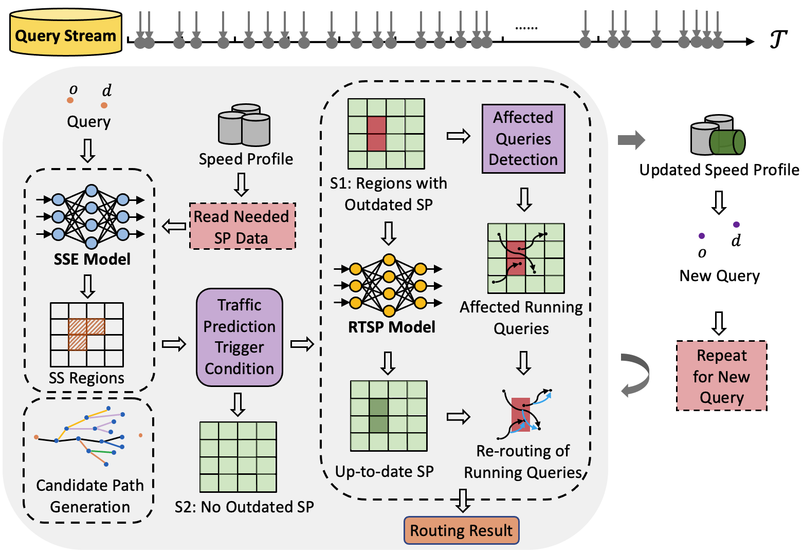

# A Just-In-Time Framework for Routing-Oriented Traffic Prediction

This is the implement of Just-In-Time Framework. The overview of the framework is as follows:

**[Step 1]** The *Search Space Estimation* model is utilized to estimate the search space. Meanwhile, the [*TTCkⁿSP*](https://github.com/edenjing/TTCKnSP) algorithm is used to compute candidate paths. This step __reduces the prediction regions spatially__ from the entire graph to a smaller set.

**[Step 2]** The *Region-based Traffic Prediction Trigger Condition* is applied to assess the validity of speed profiles within each region, thereby identifying regions requiring updates. This step further __reduces the prediction region temporally__ to only very few outdated ones.

**[Step 3]** The *Region-based Traffic Prediction* process generates the latest speed profiles within these regions.

**[Step 4]** Retrieve affected ongoing queries that have not reached their destination in the speed profile updated regions.

**[Step 5]** Perform the re-routing of affected queries and output the latest optimal paths for them.

**[Step 6]** Perform the above steps for next coming query.

## Dependencies
pytorch == 2.1.0, torchvision == 0.16.0, torchaudio == 2.1.0, pytorch-cuda = 12.1

## Handware environment
Intel Xeon Platinum 8375C 2.9GHz NVIDIA RTX 4090 24GB

## Usage
1. train SSE model and RTSP model in ./SSE/Searchsp/train_ssgrids.py and ./RTSP/train_test.py 
3. store the trained models
4. perform gloabl region prediction scheduling in ./RTSP/schedule.py
